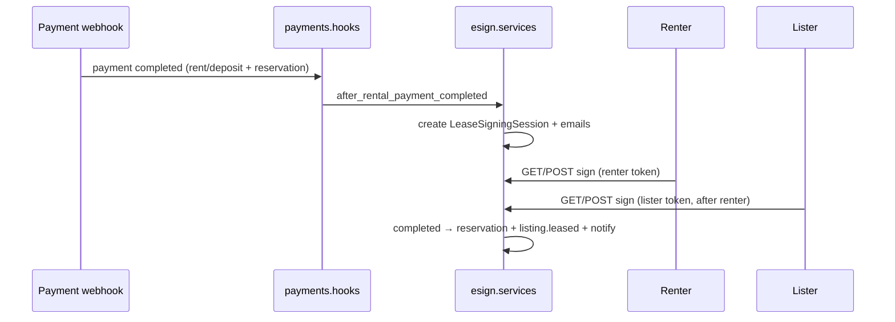

# How to add / operate the lease e-sign flow

| | |
|---|---|
| **Audience** | Engineers, technical integrators |
| **Distribution** | **Client-facing** for technical stakeholders; do not paste `.env` secrets into shared channels. |

**Product intent (PDF signing, production target):** see **[`pdf-signing-agreement.md`](./pdf-signing-agreement.md)**.

**Lister upload:** The listing owner uploads the tenancy **PDF** via **`POST /api/esign/sessions/<id>/upload-contract/`** (multipart `file`). Set **`ESIGN_AUTO_GENERATE_CONTRACT_PDF=true`** in `.env` only if you want the old auto-generated placeholder PDF (dev/testing).

This project ships **magic-link tokens** per party (renter + lister). For **testing before a vendor**, the backend **generates real PDFs** (ReportLab) and **merges signature certificate pages** (pypdf) after each party confirms - see **`esign/pdf_service.py`**. Production should replace this path with **DocuSign / Dropbox Sign** (see **`pdf-signing-agreement.md`**) and use **`provider_metadata`** for envelope ids.

---

## What gets created automatically

1. A renter completes a **rent** or **deposit** payment (`Payment.status = completed`).
2. `payments.hooks.on_payment_first_completed` runs and calls `esign.services.after_rental_payment_completed`.
3. If there is no `LeaseSigningSession` yet for that **reservation**, one row is created with:
   - `renter_token` / `lister_token` (URL-safe secrets),
   - `triggering_payment` pointing at the payment,
   - `status = pending`,
   - **`contract_pdf`** + **`contract_pdf_sha256`** (generated lease draft PDF),
   - **`signed_pdf`** updated after each signature (contract + one certificate page per party).
4. **Emails** + **in-app notifications** go to renter and lister with links to  
   `{FRONTEND_URL}/sign/lease/<token>/` (frontend route; API is separate - see below).
5. **Renter must sign first.** The lister’s token only allows signing after `renter_signed_at` is set.
6. When both have signed, `status = completed`, `reservation.dld_metadata` gets `lease_signed_at`, `listing.leased = True`, and completion emails/notifications fire. A **`post_save`** signal on `LeaseSigningSession` also keeps **`listing.leased`** in sync if completion happens through other paths.

---

## Backend checklist (new environment or fork)

### 1. Django app

- Add **`esign`** to **`INSTALLED_APPS`** (already present in this repo).
- Include URLs in the project router:

```python
# yallastay/urls.py
path("api/", include("esign.urls")),
```

### 2. Migrations

From the project directory that contains `manage.py`:

```bash
python manage.py migrate esign
```

### 3. App config loads signals

`esign.apps.EsignConfig.ready()` imports `esign.signals` so listing `leased` stays aligned when a session completes. Do not remove that import.

### 4. Environment

| Variable | Purpose |
|----------|---------|
| **`FRONTEND_URL`** | Base for links in emails and serializer `my_sign_url` (e.g. `https://app.example.com`). Must match the SPA origin users open in the browser. |

### 5. Payment hook

Lease sessions are **not** created manually in normal operation. They are triggered from **`payments.hooks`** after the first **completed** payment for **rent** or **deposit** with a **reservation**. Ensure your payment provider webhooks (or stub) mark payments **`completed`** so the hook runs.

### 6. Admin

`LeaseSigningSession` is registered in Django admin for support: search by tokens or listing title, inspect `reservation` / `triggering_payment`.

---

## API reference

All paths are under **`/api/`** unless you mount the project differently.

| Method | Path | Auth | Purpose |
|--------|------|------|---------|
| `GET` | `/api/esign/sessions/` | JWT | List sessions where the user is **renter** or **listing owner** (`listed_by`). |
| `GET` | `/api/esign/sessions/<id>/` | JWT | Same scope, single session. |
| `GET` | `/api/esign/sign/<token>/` | **None** (public) | Preview: listing title, role, `can_sign`, progress messages; includes **`pdf_url`** for iframe. |
| `GET` | `/api/esign/sign/<token>/pdf/` | **None** (public) | **`application/pdf`** - contract only until first sign, then merged signed PDF. |
| `POST` | `/api/esign/sign/<token>/` | **None** (CSRF-exempt) | Record signature and rebuild **`signed_pdf`** (test harness). |

Authenticated list/detail responses include **`pdf_api_url`** (same-origin path for the current user’s token) for dashboards.

**Important:** The signing page in the browser should call the **API** with the **token in the path** (see frontend). Do not put tokens in query strings in logs if you can avoid it.

**Error codes (POST):** `not_found`, `cancelled`, `renter_must_sign_first`, `already_done` - mapped to HTTP status and `detail` in `esign.views.LeaseSigningSignView`.

---

## Frontend (Vite + React)

### 1. Route

Register a route such as:

`/sign/lease/:token` → component that loads preview (`GET`) and submits signature (`POST`).

### 2. API client

- Authenticated list/detail: use your normal Axios client with **`Authorization: Bearer`** for `/api/esign/sessions/...`.
- Preview/sign: use **`publicApiUrl`** (or equivalent) so the request hits **`/api/esign/sign/<token>/`** with **no JWT**, on the **same origin** as the API in dev (proxy) or full API URL in prod.

### 3. Dashboard UX

Session serializer exposes **`my_sign_url`**, **`can_sign`**, **`instructions`**, **`signing_progress`** so dashboards can show steps and “Open signing page” when it is the user’s turn.

---

## Replacing the stub with a vendor (DocuSign, Dropbox Sign, …)

1. **Keep** `LeaseSigningSession` as the internal record (one per reservation).
2. **Create** the envelope / signature request via vendor API when the payment completes (instead of or after stub tokens).
3. Store **`provider_metadata`** (envelope id, request id, signer ids).
4. **Webhook:** verify signature, map events → update `renter_signed_at` / `lister_signed_at` / `status`, then reuse **`_notify_completion`** or equivalent.
5. **Deprecate** raw `POST /api/esign/sign/<token>/` or keep it only for a fallback “preview” that redirects to the vendor-hosted URL.
6. **URLs** in emails should point to **vendor** or your **embedded** signing UI, not only `/sign/lease/...`.

The model field **`provider_metadata`** exists for this migration path.

---

## Tests

- `esign/tests/test_services.py` - session creation rules, preview/sign behaviour, ordering.
- `esign/tests/test_views.py` - HTTP contract for list/detail/sign.

Run:

```bash
python manage.py test esign
```

---

## Quick flow diagram



---

## Development-only: reset a signing session and retry

**Production:** this is **not** available - `ESIGN_DEV_RESET_ENABLED` is **false** in `settings/prod.py` and the management command refuses to run.

**Local dev** (`DJANGO_ENV` not prod, default `settings/dev.py`): **`ESIGN_DEV_RESET_ENABLED`** is **true** except when the **test runner** is active (`TESTING`), so you can wipe one session and start over.

```bash
# From the directory that contains manage.py - use your LeaseSigningSession pk (admin or API).
python manage.py dev_reset_esign_session <session_id>
```

What it does:

- Deletes stored **PDFs and signature images**, clears **signature_field_boxes**, **audit events** (`LeaseSigningAuditEvent`), and sets the session back to **`pending`** with **new `renter_token` / `lister_token`** (old magic links stop working).
- If the lease was **fully signed**, it **clears** `lease_signed_at` / `lease_signing_session_id` from **`reservation.dld_metadata`**, sets **`listing.leased`** back to **false** if needed, and sets **`reservation.status`** from **`completed`** → **`confirmed`** (dev convenience only).
- If **`ESIGN_AUTO_GENERATE_CONTRACT_PDF=true`**, it **regenerates** the placeholder **`contract_pdf`** after the reset.

---

## Troubleshooting

| Symptom | Things to check |
|---------|------------------|
| No session after payment | Payment **`payment_type`** is `rent` or `deposit`; **`reservation_id`** set; status **`completed`**; session not already created for reservation. |
| Links go to wrong host | **`FRONTEND_URL`** in Django settings / env. |
| Lister cannot sign | **Renter must sign first** - `renter_signed_at` must be set. |
| Listing not hidden from search | **`listing.leased`** after completion; public listing queries exclude `leased=True`. |
| 401 on `/api/esign/sign/...` | Use **no** JWT for sign routes; use `publicApiUrl` / fetch without `Authorization`. |

---

*For platform-wide behaviour (payments, listings, Stripe), see [`../payments/stripe-setup.md`](../payments/stripe-setup.md) and [`../platform/vision-and-implementation.md`](../platform/vision-and-implementation.md).*
