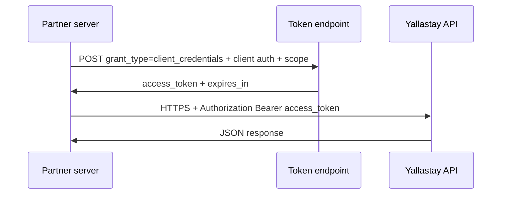

# Partner API authentication — OAuth 2.0 client credentials

| | |
|---|---|
| **Audience** | Partners, integrators, security reviewers, internal platform engineers |
| **Purpose** | Describe the **recommended machine-to-machine (M2M)** pattern for **server-to-server** API access, aligned with **OAuth 2.0** ([RFC 6749](https://www.rfc-editor.org/rfc/rfc6749)). |
| **Disclaimer** | This document is a **technical and policy baseline**. It is **not** a guarantee that every endpoint is already exposed to partners or that a particular token URL is live in your environment—confirm with your integration agreement and API catalog. |

---

## 1. How this fits Yallastay today

| Client type | Typical pattern today | Notes |
|-------------|----------------------|--------|
| **Browser SPAs** (marketplace, staff console) | **JWT** from user login (**Simple JWT** / password or equivalent) | End-user or verification specialist **identity**; tokens represent a **user**. |
| **Partner backends** (ERP, CRM, data sync, B2B portal server) | **OAuth 2.0 client credentials** (recommended) | No interactive user on the partner’s server; the caller is a **registered client**, not a person logging in through your UI. |

**Why document client credentials:** Raw “API keys” sent on every request are common but **OAuth 2.0 client credentials** is the usual **enterprise-grade** answer: a **client id**, a **client secret**, a **token endpoint**, **scoped** access tokens, and **standard rotation** semantics. Partners and auditors recognize the flow immediately.

Implementations often use **OAuth 2.0** frameworks (e.g. **django-oauth-toolkit**, **Auth0**, **AWS Cognito**, **Azure AD**, **Keycloak**) in front of or beside Django; the **protocol** below is what you standardize on regardless of vendor.

---

## 2. OAuth 2.0 client credentials grant (summary)

**RFC 6749, section 4.4 — Client Credentials Grant**

- The **resource owner** is the **client itself** (the partner’s application), not an end-user.
- The client exchanges **client_id** + **client_secret** (or mTLS, in stricter setups) for an **access token** at the **token endpoint**.
- The client calls **resource servers** (your API) with **`Authorization: Bearer <access_token>`** until the token expires.



---

## 3. Token request (normative shape)

Partners send a **POST** to your **token endpoint** (exact URL is environment-specific; document it in your partner portal).

**HTTP**

- **Method:** `POST`
- **Content-Type:** `application/x-www-form-urlencoded` (typical) or `application/json` (some providers—pick one and document it)
- **TLS:** HTTPS only in production

**Body parameters (RFC 6749)**

| Parameter | Required | Meaning |
|-----------|----------|---------|
| `grant_type` | Yes | Must be `client_credentials` |
| `scope` | Optional | Space-delimited scope string; **prefer required scopes** for least privilege |

**Client authentication**

RFC allows several methods. The most common for confidential server clients:

- **HTTP Basic** with `client_id` as username and `client_secret` as password, **or**
- **`client_id` + `client_secret`** in the form body (supported by many providers; document if you allow it)

**Example (conceptual — do not treat as live URL)**

```http
POST /oauth/token/ HTTP/1.1
Host: api.example.com
Content-Type: application/x-www-form-urlencoded
Authorization: Basic <base64(client_id:client_secret)>

grant_type=client_credentials&scope=listings.read%20bookings.read
```

**Successful response (typical JSON)**

| Field | Meaning |
|-------|---------|
| `access_token` | Opaque or JWT string used on API calls |
| `token_type` | Usually `Bearer` |
| `expires_in` | Lifetime in seconds |
| `scope` | Granted scopes (if applicable) |

---

## 4. Calling the API

- **Header:** `Authorization: Bearer <access_token>`
- **Errors:** **`401`** invalid or expired token; **`403`** valid token but insufficient scope or policy denial.

Separate **scopes** (or fine-grained policies) per partner class: e.g. read-only listings vs. write webhooks.

---

## 5. Operational and security practices (professional baseline)

| Practice | Rationale |
|----------|-----------|
| **Per-partner client** | Issue **one client id per integration** (or per environment: sandbox vs production), not one global key for everyone. |
| **Short-lived access tokens** | Limits damage if a token leaks; partner refreshes via another client-credentials exchange. |
| **Secret storage** | Partner stores **client_secret** in a **secret manager**, not source control or shared chat. |
| **Rotation** | Support **secret rotation** and document an **incident revocation** SLA. |
| **Sandbox** | Separate **token endpoint + credentials** for non-production. |
| **Rate limits** | Apply per **client_id** at the API edge. |
| **Audit** | Log **client_id**, scopes, and outcome (without logging secrets or full tokens). |
| **Transport** | **TLS 1.2+** only; consider **mTLS** or IP allowlists for high-trust contracts. |

---

## 6. Contract checklist (what to put in partner agreements)

- Allowed **base URLs** (sandbox vs production)
- **Token endpoint** path and **client authentication** method
- **Scopes** or equivalent permission matrix
- **Rate limits** and **support contacts**
- **Data categories** processed under the integration (privacy / DPA alignment)
- **Revocation** process when the partnership ends

---

## 7. Related documents

| Document | Link |
|----------|------|
| Partner & investor overview (architecture pointer) | [`../presentations/partner-investor-platform-overview.md`](../presentations/partner-investor-platform-overview.md) |
| Security controls overview | [`../SECURITY_CHECKLIST.md`](../SECURITY_CHECKLIST.md) |
| Defense layers (authZ, XSS, etc.) | [`../security/defense-layers.md`](../security/defense-layers.md) |

---

*For interactive user authentication (browsers), continue to follow JWT login and refresh flows documented in engineering runbooks and `MANUAL_TESTING.md` as applicable.*
