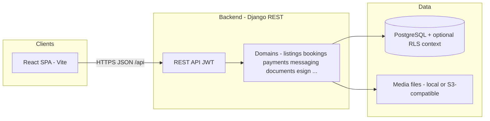

# Yallastay — Partner & investor platform overview

| | |
|---|---|
| **Audience** | Strategic partners, investors, senior technical due diligence |
| **Scope** | Full-stack product: **Django API** (this repo) + **React web app** (sibling `yallastay` repo) |
| **Disclaimer** | This deck describes **current implementation and stated direction**. It is **not** a legal warranty, revenue forecast, or certification. Distribution under **NDA** recommended; redact hostnames and credentials if exported. |

**Companion material:** live demo runbook [`../DEMO_PRESENTATION.md`](../DEMO_PRESENTATION.md) · technical depth [`../platform/vision-and-implementation.md`](../platform/vision-and-implementation.md) · **partner / M2M auth (OAuth 2.0 client credentials)** [`../platform/partner-api-authentication.md`](../platform/partner-api-authentication.md) · client-facing doc index [`../client/README.md`](../client/README.md).

---

## Executive summary

**Yallastay** is a **UAE-oriented rental marketplace platform** delivered as an **API-first** backend and a **responsive web** frontend. The product connects **renters** (including students), **landlords**, and **real estate brokers** around **searchable listings**, **reservations**, **payments** (development stub and **Stripe** production path), **in-app messaging**, **document verification**, **optional lifestyle add-ons**, and an **in-house lease e-sign** flow that produces **auditable PDFs** and ties completion back to listings and reservations.

The architecture is built to support **one journey** end-to-end: discover a home → book → pay → sign → status in the app, with room to plug in **stronger e-sign vendors** and **government / registry** steps as the business matures.

---

## Problem space

| Stakeholder | Friction we address |
|-------------|---------------------|
| **Renters / students** | Fragmented search, weak trust signals, unclear verification, payments and paperwork scattered across chat and PDFs |
| **Landlords** | Marketing exposure, broker coordination, **Dubai-style** listing rules (e.g. title deed, **Trakheesi** permit context on broker-led ads), need for controlled handoff to signing |
| **Brokers** | Need to operate within **RERA / DLD** expectations on advertising, while staying visible to owners choosing a verified broker |
| **Operators (Yallastay)** | Need **staff tooling** to approve brokers and owners against a **consistent document checklist**, not only ad-hoc admin |

---

## Product pillars (what ships today)

| Pillar | What the platform does |
|--------|-------------------------|
| **Marketplace** | Listings with filters, areas, favorites, public detail; landlord and **broker-published** listings with role-appropriate rules |
| **Trust & verification** | **UAE ID** path for renters, **university** path for students, **document types** for owners and brokers; **staff verification console** (SPA + API) for approve/reject with notifications |
| **Commerce** | **Rent / deposit / fee / lifestyle** payment initiation; **stub** provider for demos and CI; **Stripe** Checkout + webhooks for production-shaped flows |
| **Operations after money** | On first **completed** rent/deposit linked to a **reservation**, the system can open a **lease signing session**, notify parties, and merge **signature evidence** into PDFs (see e-sign docs) |
| **Engagement** | **Conversations per listing**, notifications, reviews, optional **roommate** profile, **lifestyle** plans and subscriptions for renters with a valid reservation gate |
| **Governance** | User reports, analytics hooks, transactional **email** (and **SMS** app for future/optional use), Django **admin** |

---

## Technical architecture

### High-level

- **Frontend:** **React** (Vite), talks to **`/api`** on the same origin in dev (proxy) or to an explicit **`VITE_API_URL`** in production builds.
- **Backend:** **Django 4.x** + **Django REST Framework** + **Simple JWT**; **CORS**-aware for split SPA/API hosting (e.g. Railway).
- **Data:** **PostgreSQL** in production-style configs; **row-level security** middleware is part of the defense-in-depth story (see [`../DATABASE_RLS.md`](../DATABASE_RLS.md)).
- **Async edge:** payments and signing rely on **webhooks** (Stripe, stub) and **server-side hooks** (`payments.hooks` → e-sign services), not on long-held browser connections.

### Partner integrations (OAuth 2.0 client credentials)

For **machine-to-machine** access—partner **servers**, ERP, or data pipelines, not a person signing in through your SPA—the **recommended** industry pattern is **OAuth 2.0 client credentials** ([RFC 6749](https://www.rfc-editor.org/rfc/rfc6749) §4.4): the partner registers a **confidential client**, exchanges **client id + secret** at a **token endpoint** for a **short-lived access token**, and calls your JSON API with **`Authorization: Bearer`**. That is distinct from **interactive user JWT** used by the marketplace and staff web apps (**Simple JWT** today).

**What this deck claims today:** the platform is **API-first** and **JWT-based for interactive clients**. **Dedicated partner OAuth** (token URL, client registry, scopes) is **documented as the target contract** for B2B integrations—not asserted here as a fixed production feature list. See [`../platform/partner-api-authentication.md`](../platform/partner-api-authentication.md) for the full framing, example request shape, and operational checklist for agreements.

### Backend domains (Django apps)

| App | Investor-readable role |
|-----|-------------------------|
| **core** | Areas, universities, shared utilities, RLS middleware |
| **accounts** | Users, profiles, UAE / university verification, **realtor & landlord** profiles, **staff verification API** |
| **listings** | Properties, **Trakheesi** / title-deed fields, leasing flags |
| **bookings** | Reservations and lifecycle tied to listings |
| **payments** | Initiation, Stripe/stub checkout, webhooks, receipts hooks |
| **messaging** | Listing-scoped threads, team messages around payments |
| **documents** | Typed uploads; staff read access where policy allows |
| **esign** | Lease sessions, tokens, signing order, PDF pipeline |
| **lifestyle_services** | Plans and subscriptions linked to reservations |
| **notifications** | In-app notification fan-out |
| **reviews**, **reports**, **analytics**, **roommates** | Trust, safety, discovery, and upsell adjacent features |
| **emails**, **sms** | Outbound comms plumbing |

---

## Frontend (sibling repository)

| Topic | Implementation note |
|-------|------------------------|
| **Stack** | **React** + **Vite**; SPA routes for search, property detail, dashboard, services, payments, **lease signing** (`/sign/lease/:token`); **staff verification** in sibling **`yallastay_staff`**; profile, messages, etc. |
| **Auth** | JWT in browser storage; refresh and **login redirect with return path** for staff routes; optional **staff-only host** in production builds via env |
| **Parity** | Feature work is **API-driven**; new surfaces are added as routes + API client modules against the same contract the mobile apps would reuse later |

---

## UAE alignment (positioning, not legal advice)

Product rules for **what** to collect and how brokers and owners interact with **title deed** and **advertising permit** concepts are documented for **product and engineering alignment** — see [`../product/uae-verification-pipeline.md`](../product/uae-verification-pipeline.md). **Government automation** (Ejari/DLD) is **roadmap**, not a claim of live integration.

---

## Security & privacy (headline)

- **Layered controls:** authentication, authorization on views, **PostgreSQL RLS** where enabled, input sanitization on sensitive staff actions, CORS and production **HTTPS** expectations — summarized for stakeholders in [`../SECURITY_CHECKLIST.md`](../SECURITY_CHECKLIST.md) and [`../security/defense-layers.md`](../security/defense-layers.md).
- **Partner / M2M access:** **OAuth 2.0 client credentials** is the documented baseline for **server-to-server** integrations (see [`../platform/partner-api-authentication.md`](../platform/partner-api-authentication.md)); distinguish from **end-user JWT** in browsers.
- **Sensible demo posture:** development **stub payment webhook** must never be treated as production security; investor demos should stay on **stub** unless Stripe is explicitly rehearsed.

---

## Deployment & demo

| Environment | Notes |
|-------------|--------|
| **Local** | Backend `runserver` + frontend `npm run dev`; `bootstrap_demo` seeds areas, lifestyle plans, and **presentation accounts** including staff queue fixtures |
| **Hosted (e.g. Railway)** | Split **API** and **static SPA**; production requires **`FRONTEND_URL`**, **`ALLOWED_HOSTS`**, **`CORS_ALLOWED_ORIGINS`**, database URL, secrets — see [`../DEMO_PRESENTATION.md`](../DEMO_PRESENTATION.md) |
| **Investor walkthrough** | Same document: **12–18 minute** script (marketplace, tenant lifestyle stub, landlord/broker, **staff verification**, optional **rent → e-sign** beat) |

---

## Roadmap honesty (what this deck does *not* claim)

| Topic | Status |
|-------|--------|
| **Native iOS/Android apps** | **Roadmap**; API-first web today — see [`../product/mobile-roadmap.md`](../product/mobile-roadmap.md) |
| **Full Ejari / DLD automation** | **Not integrated**; metadata hooks and manual process — see [`../product/mvp-gap-analysis.md`](../product/mvp-gap-analysis.md) |
| **Bank transfer rent** | **Out of scope** for unified Checkout today |
| **Production e-sign vendor** | **In-house PDF path** demonstrates the contract; enterprise story may add **DocuSign-class** vendors (see [`../esign/pdf-signing-agreement.md`](../esign/pdf-signing-agreement.md)) |
| **Partner server-to-server OAuth** | **Interactive JWT** ships for web; **OAuth 2.0 client credentials** for partners is **documented** as the target M2M pattern—see [`../platform/partner-api-authentication.md`](../platform/partner-api-authentication.md) |

---

## Why this architecture for partners

1. **One API contract** — Web now; **mobile later** without rewriting core business rules on the client.
2. **Webhook-native money** — Aligns with how **Stripe** and future **e-sign SaaS** expect to integrate.
3. **Explicit verification domain** — Supports **regulated-market storytelling** (UAE) and **staff scalability** beyond Django Admin alone.
4. **Operational realism** — Lifestyle services, messaging, and notifications show the platform is meant to run **after** the first booking, not only as a classifieds site.

---

## Suggested Q&A preparation

| Question | Where to look |
|----------|----------------|
| “Walk me through renter → money → contract.” | [`../operations/happy-path-e2e-checklist.md`](../operations/happy-path-e2e-checklist.md), `core.tests.test_happy_path_chain` |
| “How do brokers differ from landlords in listings?” | [`../platform/vision-and-implementation.md`](../platform/vision-and-implementation.md), listings product rules |
| “What’s MVP vs nice-to-have?” | [`../product/mvp-gap-analysis.md`](../product/mvp-gap-analysis.md) |
| “What do we send data-room reviewers?” | [`../client/README.md`](../client/README.md) |
| “How should partners authenticate server-to-server?” | [`../platform/partner-api-authentication.md`](../platform/partner-api-authentication.md) (OAuth 2.0 **client credentials**) |

---

## Contact block (fill before sending)

| | |
|---|---|
| **Company** | Yallastay |
| **Document version** | 1.0 |
| **Primary contact** | *Name · role · email* |
| **Materials under NDA** | *Yes / No* |

---

*End of deck. For engineering-only gap tracking after demos, see [`../DEMO_GAP_REVIEW.md`](../DEMO_GAP_REVIEW.md).*
